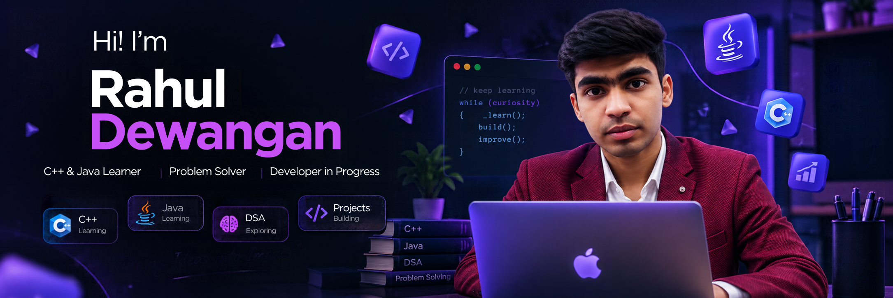

  
# 👋 Hi, I'm Rahul Dewangan

### C++ & Java Learner • Problem Solver • Developer in Progress

  

  

---

## 👋 About Me

I'm Rahul, a developer in progress who enjoys **learning programming, solving problems, and building projects**.

Currently focusing on:

- 💻 C++
- ☕ Java
- 🧠 Data Structures & Algorithms
- 🚀 Building small projects
- 📚 Improving problem-solving skills

---

## 🛠️ What I'm Learning

  

  

`C++` &nbsp; `Java` &nbsp; `DSA` &nbsp; `Problem Solving`

---

## 🚀 My Projects

 

---

## 🤝 Open to Collaborate

### 🚀 Let's Build Something Together

I'm open to collaborating on:

- 💻 C++ / Java projects
- 🧠 DSA & problem-solving projects
- 🚀 Beginner-friendly software projects
- 🏆 Hackathons & coding competitions
- 💡 Interesting project ideas

If you have an idea and want to build something together, feel free to reach out.

---

## 📊 GitHub Stats

  

---

## 📈 Contribution Activity

---

## 🐍 Contribution Snake

---

## 🌱 Currently

| | |
|---|---|
| 💻 **Learning** | C++ & Java |
| 🧠 **Exploring** | Data Structures & Algorithms |
| 🚀 **Building** | Small Projects |
| 📚 **Improving** | Problem Solving |
| 🤝 **Looking For** | Project Collaborations |

---

## ⭐ Support My Work

If you find my projects interesting, consider **following me on GitHub** and checking out my repositories.

---

## 📫 Connect With Me

 

### ✨ Learn • Build • Improve

 

